# Editor Showcase

[Go to README](../../README.md)

**Note that the syntax supported in the plan, as well as some less common syntax, is not yet supported for rendering and will be displayed in plain text style:**

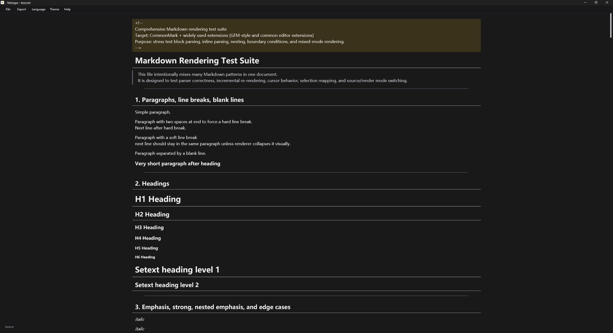

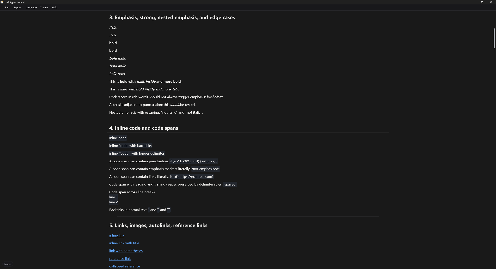

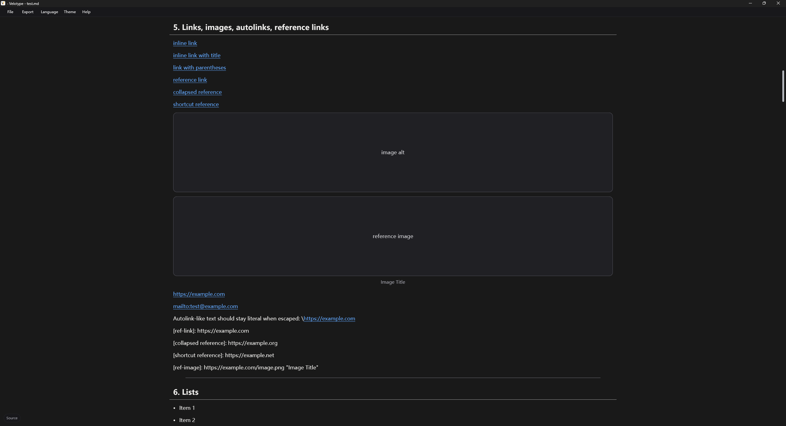

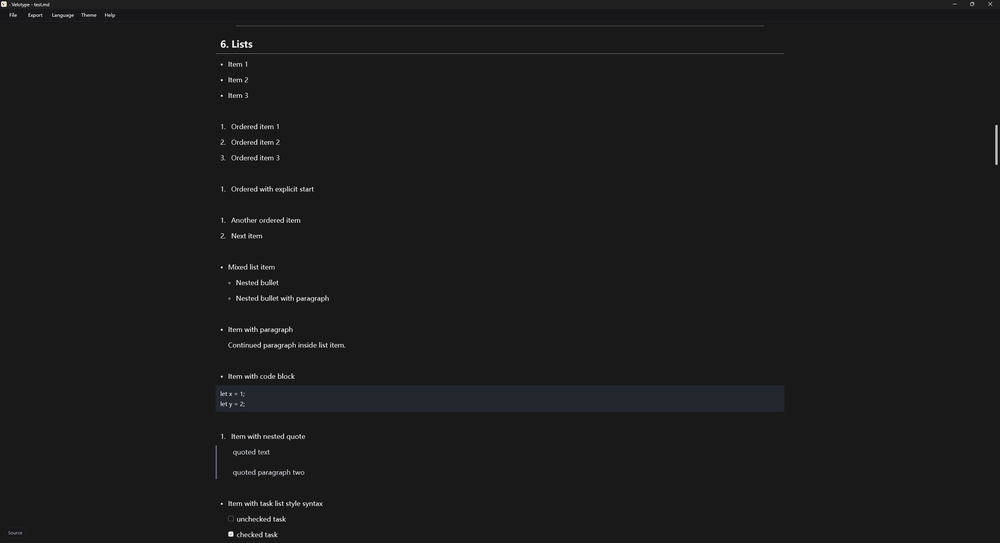

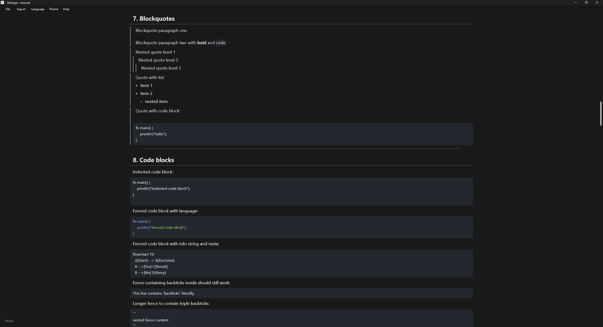

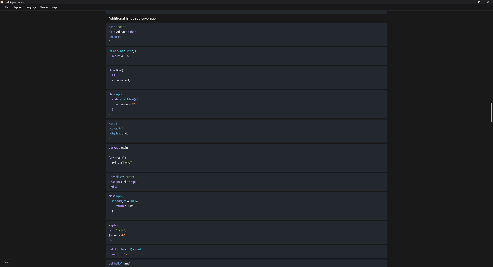

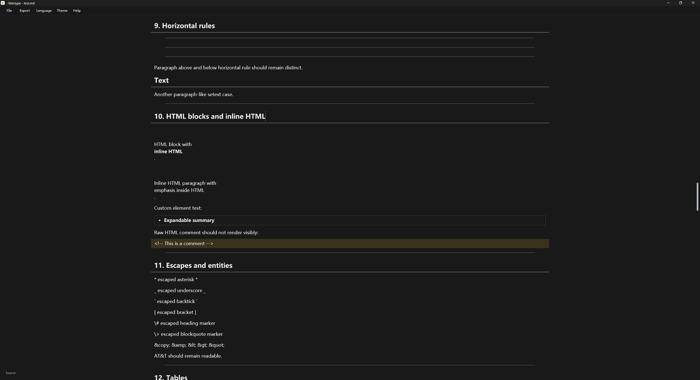

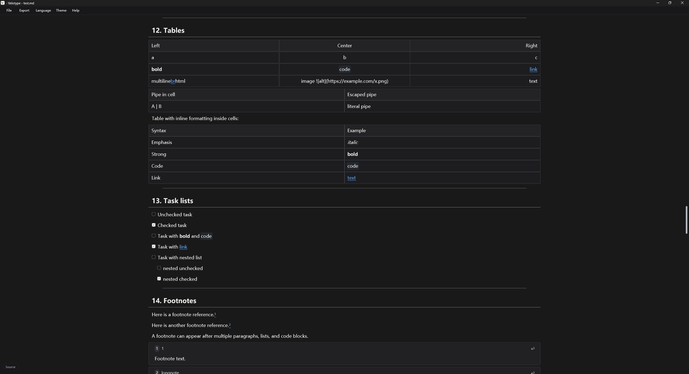

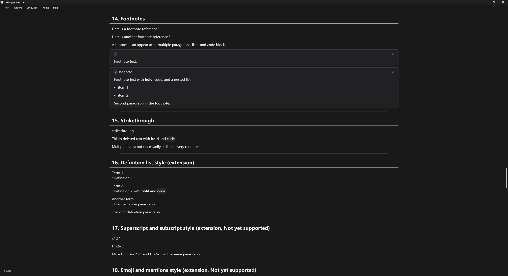

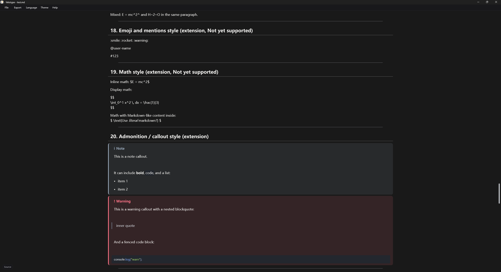

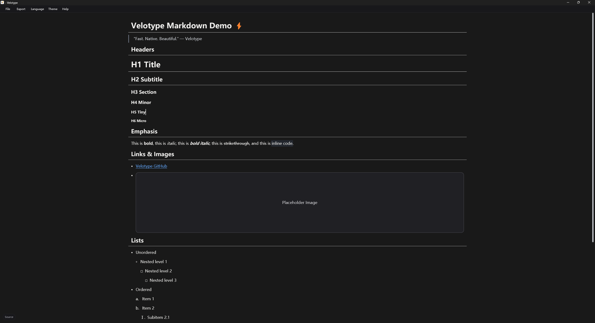

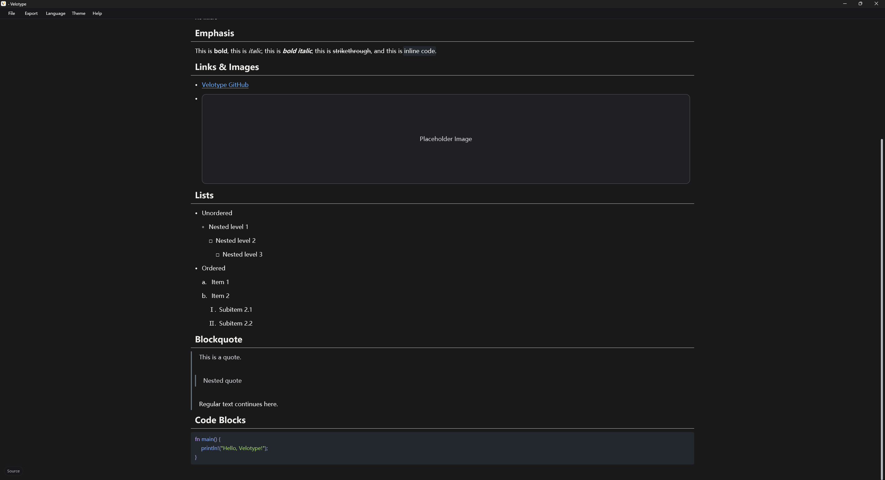
