# Editor Showcase

[Go to README](../../README.md)

**Note that the syntax supported in the plan, as well as some less common syntax, is not yet supported for rendering and will be displayed in plain text style:**

- Paragraphs, line breaks, blank lines:

- Headings:

- Emphasis, strong, nested emphasis, and edge cases:

- Inline code and code span:

- Links, images, autolinks, reference links:

- Lists:

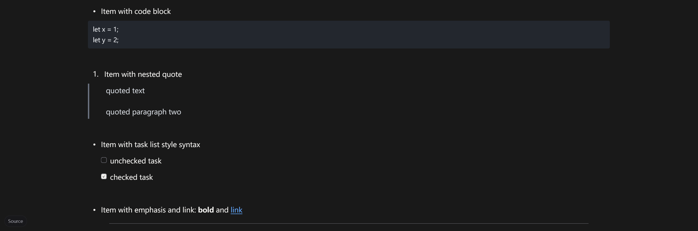

- Blockquotes:

- Code blocks:

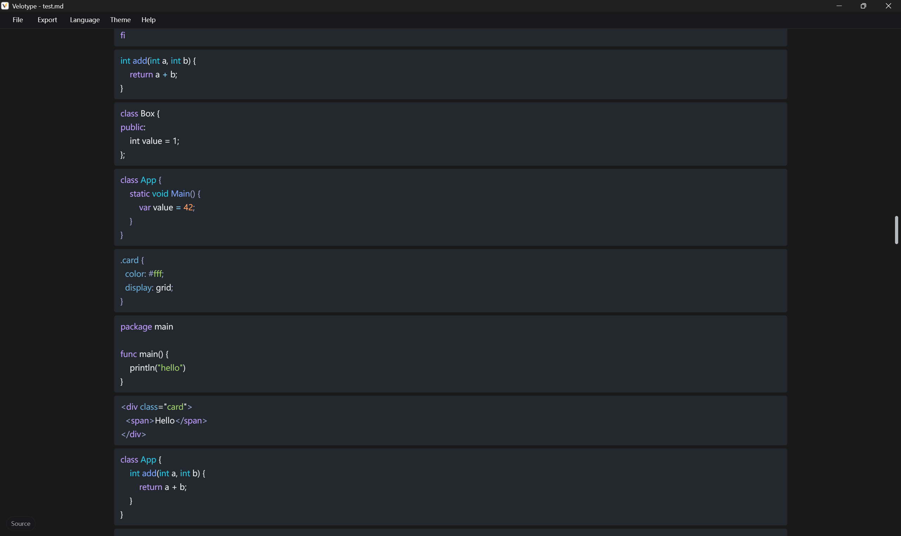

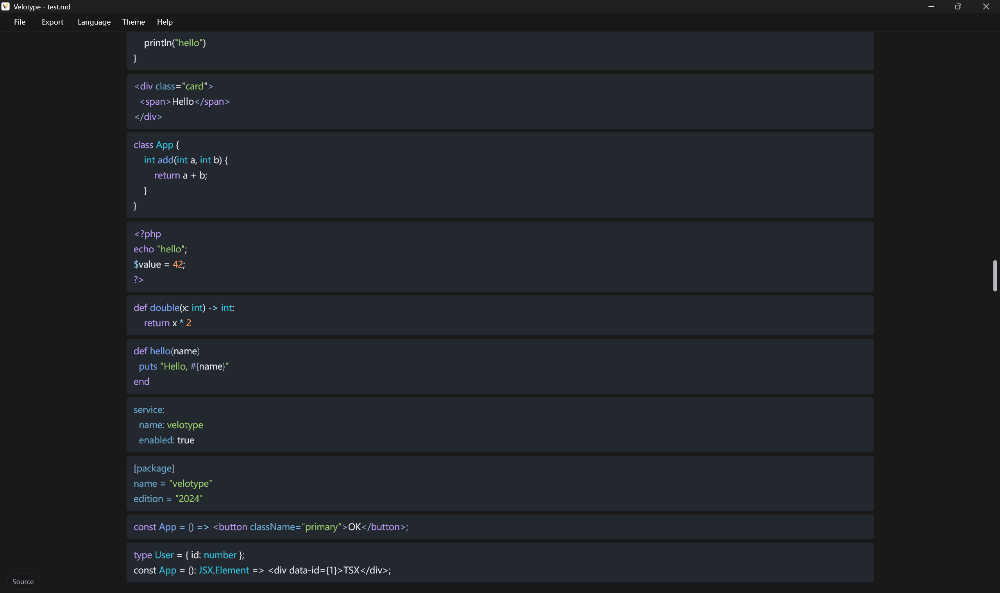

- Horizontal rules:

- HTML blocks:

- Escapes and entities:

- Table block:

- Task lists:

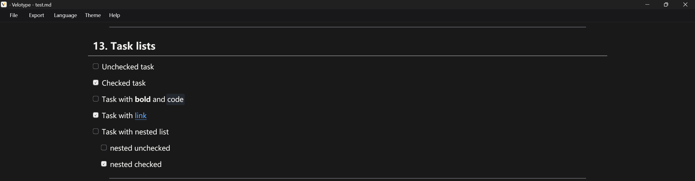

- Footnotes:

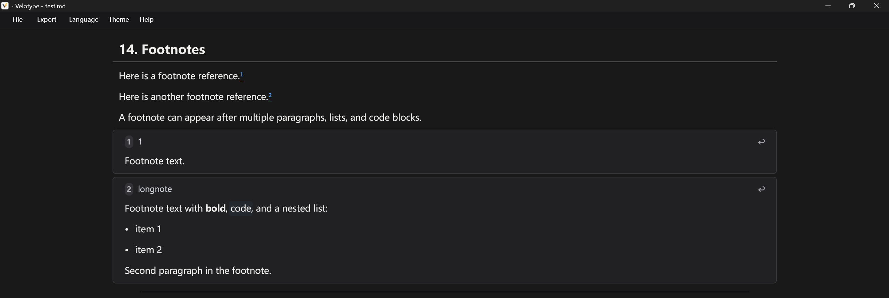

- Strikethrought:

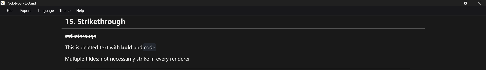

- Definition list style:

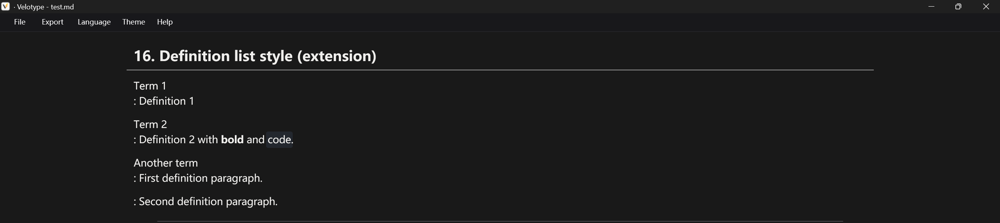

- Superscript and subscript style:

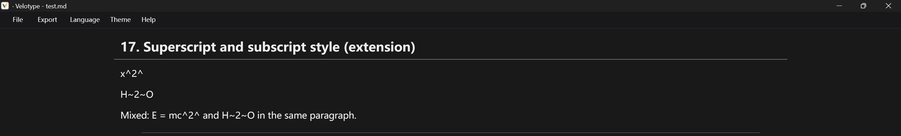

- Emoji and mention style:

> Tip: The Emoji index has not been created, but directly entering Emoji characters is supported for rendering.

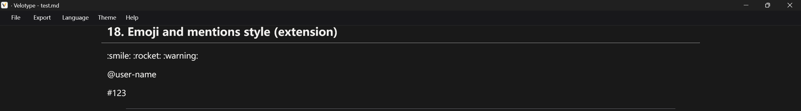

- Math style(LaTex):

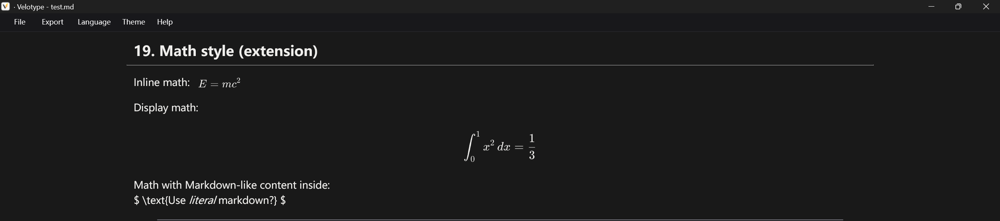

- Callout style:

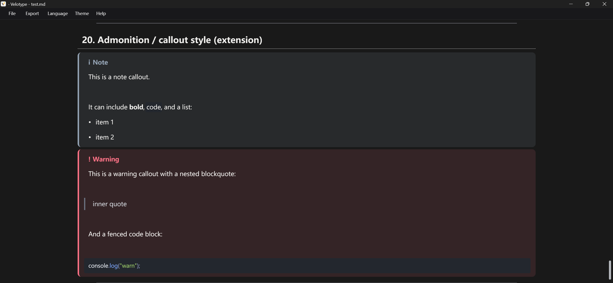

- Mixed tests:

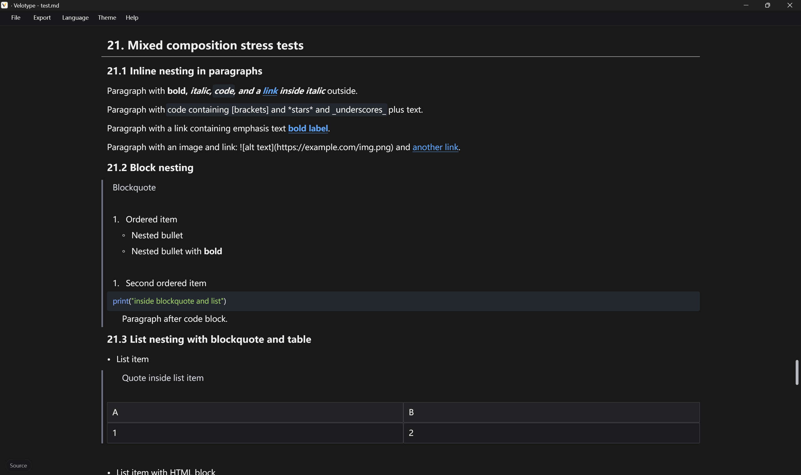

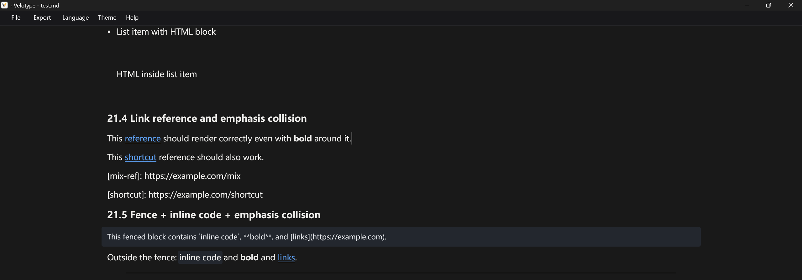
